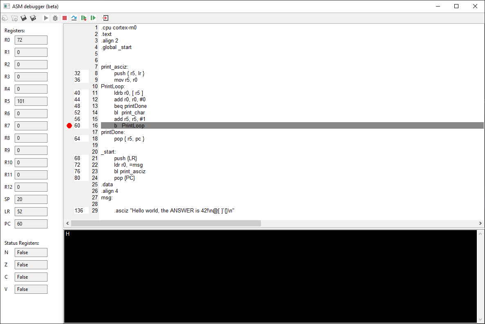

# ARM Cortex M0 interpreter

### Features

- Implements basic instructions like MOV, LDR(H/B), STR(H/B), PUSH, POP, ADD, SUB, CMP
- Supports Branch and Branch-link instructions as well as conditional branch instructions
- Error handling for both the parse and run steps, showing the call stack for runtime errors
- A visualizer to show the registers of the simulated processor and the current instruction and interact with the memory of the simulated processor


### Conditional branch instructions

These conditional branch instructions are supported:

- BCC/BCLO: carry clear / unsigned lower
- BCS/BHS: Carry set / unsigned higher or same
- BEQ: Equal / zero
- BGE: Signed greater than or equal
- BGT: Signed greater than
- BHI: Unsigned higher
- BLE: Signed less than or equal
- BLS: Unsigned lower or same
- BLT: Signed less than
- BMI: Minus / negative
- BNE: Not equal / not zero
- BPL: Plus / zero or positive
- BVC: No overflow
- BVS: Overflow

### settings

To use the Interpreter, The settings in the main.py file must be changed:

- Change the string after fileName to the name of the file you want to run the interpreter with.
- By changing useGUI to False, the visualizer can be disabled entirely. this is useful when it is not needed because the program will run faster without the visualizer.
- The stack size can be changed by changing the number after stackSize. The default setting is 0x40, which is 64 byes. Changing it to 0x400 will result in a stack of 1 KB.
- The interpreter needs to know what subroutine to call first. This can be set with the startLabel variable. The default value is '\_start'

### error detection

To enable the user to find problems in their code easily, clear errors are thrown when problems occur. When a runtime error occurs, a stacktrace is printed to make it easy to trace the problem back. In the console, the error messages should be red. This works in PyCharm but does not seem to work in the Windows terminal. Because this is purely a visual bug, this has not yet been fixed.


Note: to create this image, the stack size has been set as low as 16 bytes

### Printing to the console

Printing to the console is possible by using the subroutines ```print_char``` and ```print_int```:

```bl print_char```

```bl print_int```


### The visualizer

Using the visualizer, the register processor can be viewed easily to make debugging code easier. It is also possible to single-step the program to see exactly when the program broke. The current instruction and its location in the source code is shown to make it easy to find the instruction in the source code.




The icons for New, Open, Save and Save As have been sourced from here: https://findicons.com/pack/566/isimple_system

# Installing

## Windows

1. Installeer **python 3** en **git** als je dit nog niet gedaan hebt
2. Voeg python toe aan path als je dit nog niet gedaan hebt: https://datatofish.com/add-python-to-windows-path/
3. Voer het commando ```pip3 install wxpython``` uit als admin
4. Voer het commando ```git clone https://github.com/Lennart99/ASM-interpreter.git``` uit om de git repository te clonen
5. Je kan nu de interpreter uitvoeren door ```python main.py``` uit te voeren in de interpreter folder van de git repository

## Linux

1. Installeer **git** als je dit nog niet gedaan hebt
2. Voer het commando ```git clone https://github.com/Lennart99/ASM-interpreter.git``` uit om de git repository te clonen
3. Voer het commando ```sudo sh install.sh``` uit in de cloned git repository
4. Je kan nu de interpreter uitvoeren door ```python3 main.py``` uit te voeren in de interpreter folder van de git repository
